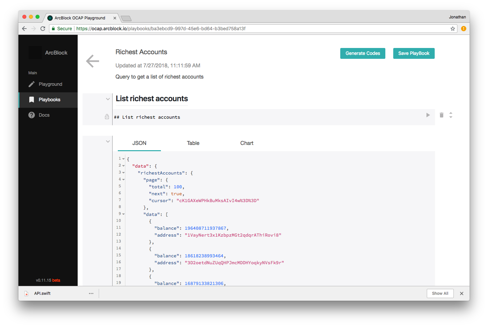
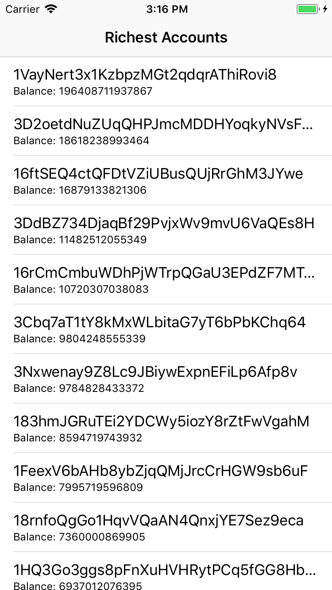

# 快速入门

ArcBlock平台旨在为您提供深入探索和利用区块链上的数据的能力，而我们的iOS SDK的目标则是帮助您将这种能力轻松接入到您的iOS应用中。这篇文档中，我们将会介绍如何最简单地创建出一个接入OCAP service的iOS应用。

假设我们的应用需要展示一个最富有的比特币账户的列表，以下是最快速的实现步骤。

## 安装SDK

请参考我们的基础[README](./README.CN.md)中介绍安装的部分。

## 编写GraphQL查询语句

与ArcBlock平台通信，您需要接入我们的开放链访问协议（OCAP）接口。OCAP通过GraphQL提供了一个统一的接口供您对链上数据进行各种操作（查询、订阅、修改），而且作为开发者，您可以自定义您所需要的返回数据。您可以到我们的[OCAP Playground](https://ocap.arcblock.io/)尝试编写和测试GraphQL查询语句。Playground会是一个很好的试验田，通过它您可以很快熟悉我们的OCAP接口。更多关于GraphQL的介绍，请看他们的[官方网站](https://graphql.org/).

在您尝试编写了查询语句之后，您可以将query另存为一个playbook，并使用它来生成Swift代码。您可以[在此](https://ocap.arcblock.io/playbooks/ba3ebcd9-997d-45e6-bd64-b3bed758a13f)查看查询最富有的比特币账号的playbook。

## 生成Swift代码

GraphQL的一大特性是，当查询语句和schema确定了之后，我们可以预期请求的参数和返回的数据的类型都是确定的，即强类型的。Swift也具备这样的特性。因此，我们可以在编译时确保数据的类型。这就是提供代码生成功能的原因。我们将会为您生成请求操作和返回数据的包装类，这些类可以和我们的SDK一起工作，确保类型安全。我们将不再会遇到运行时的类型错误了。

Swift代码生成工具已经被继承在了Playbook里。您可以看到每个Playbook的右上角都有一个**Generate Codes**按钮。选择语言为Swift，然后点击生成，我们将生成一个API.swift 文件，并将它下载到您本地。然后，您只需要将它拖拽进您的XCode项目中即可。



## 初始化一个ABSDKClient

现在，让我们开始写一写代码吧。

首先我们需要初始化一个ABSDKClient实例。ABSDKClient将负责发送查询语句、解析结果和管理缓存。您可以每次请求时创建一个实例，也可以整个应用共享一个实例：

``` Swift
// in AppDelegate.swift

var arcblockClient: ABSDKClient!

func application(_ application: UIApplication, didFinishLaunchingWithOptions launchOptions: [UIApplicationLaunchOptionsKey: Any]?) -> Bool {
    // Override point for customization after application launch.
    let databaseURL = URL(fileURLWithPath: NSTemporaryDirectory()).appendingPathComponent("ocap-demo-db")
    do {
        // initialize the AppSync client configuration configuration
        let arcblockConfiguration = try ABSDKClientConfiguration(endpoint: .btc, databaseURL: databaseURL)
        // initialize app sync client
        arcblockClient = try ABSDKClient(configuration: arcblockConfiguration)
    } catch {
        print("Error initializing ABSDKClient. \(error)")
    }
    return true
}
```

## 创建 ViewController

现在，让我们使用ABSDKClient来发送查询语句，并显示查询结果。我们需要先创建一个ViewController，对此我们可以使用文件模板：


现在我们就创建好了一个新的ABSDKTableViewController和ABSDKTableViewCell的子类。

### 配置 ViewController

接下来，我们需要给ViewController配置一些属性。

```swift
// in ViewController.swift

override func configDataSource() {
    // config the parameters for initiating data source

    let appDelegate = UIApplication.shared.delegate as! AppDelegate
    client = appDelegate.arcblockClient

    dataSourceMapper = { (data) in
        return data.richestAccounts?.data
    }
    pageMapper = { (data) in
        return (data.richestAccounts?.page)!
    }
    query = RichestAccountsQuery()
}
```

以上的代码定义了一些属性，如客户端实例、提取数组字段的闭包、提取分页信息字段的闭包、页面更新的回调闭包以及需要发送的查询语句实例。

## 在cell中显示查询结果

然后，我们需要将TableViewCell中的UI元素和数据连接起来：

```swift
// in AccountListCell.swift

override func updateView(data: RichestAccountsQuery.Data.RichestAccount.Datum) {
    self.textLabel?.text = data.address
    self.detailTextLabel?.text = "Balance: " + String(data.balance!)
}
```

我们在创建Swift文件的同时也创建了一个XIB文件。您可以一定程度上自定义cell的UI布局。

## 运行

到这里所有工作都已经做完了，我们可以来尝试运行一下应用。



可以看到，模板基类处理了网络请求、结果解析、缓存管理、数据绑定和分页等操作。

这个项目的代码可以在[这里](./Example/RichestAccounts)查看.

如果您需要对您的ViewController做更多的自定义设计实现，而希望SDK仅仅提供数据和网络层面的功能，请您参考[数据绑定](https://github.com/ArcBlock/arcblock-ios-sdk/blob/master/DataBinding.CN.md)、[客户端](https://github.com/ArcBlock/arcblock-ios-sdk/blob/master/Client.CN.md) 以及[类参考](http://ios-docs.arcblock.io/)文档。
