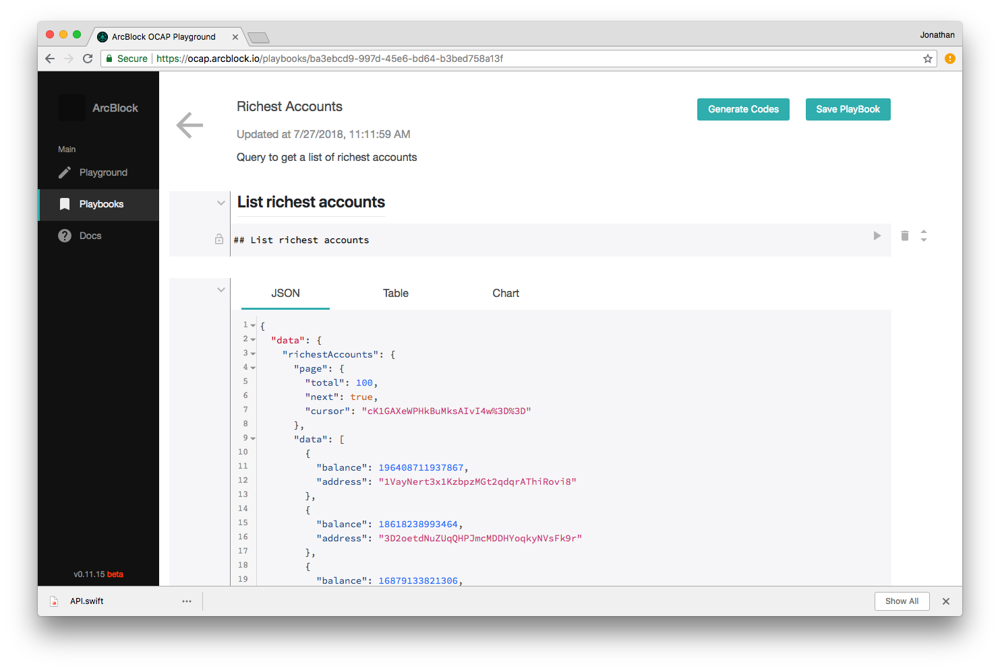
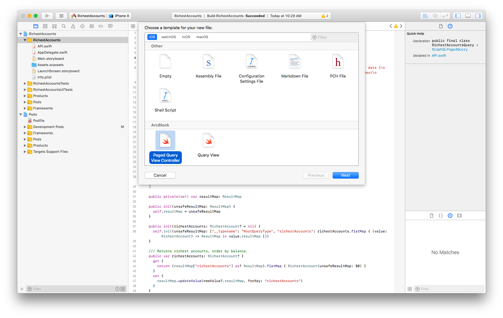
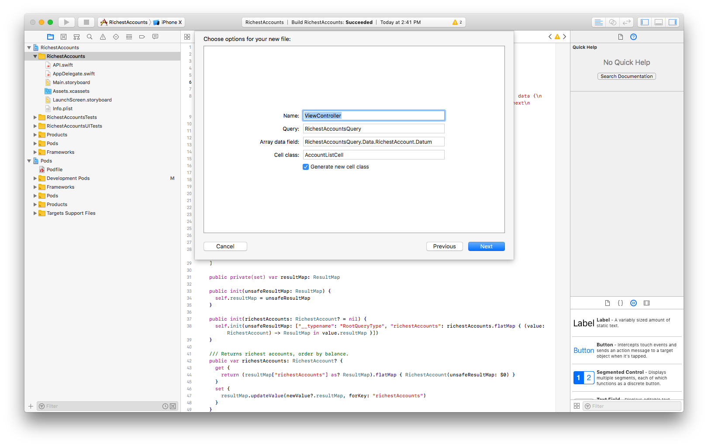
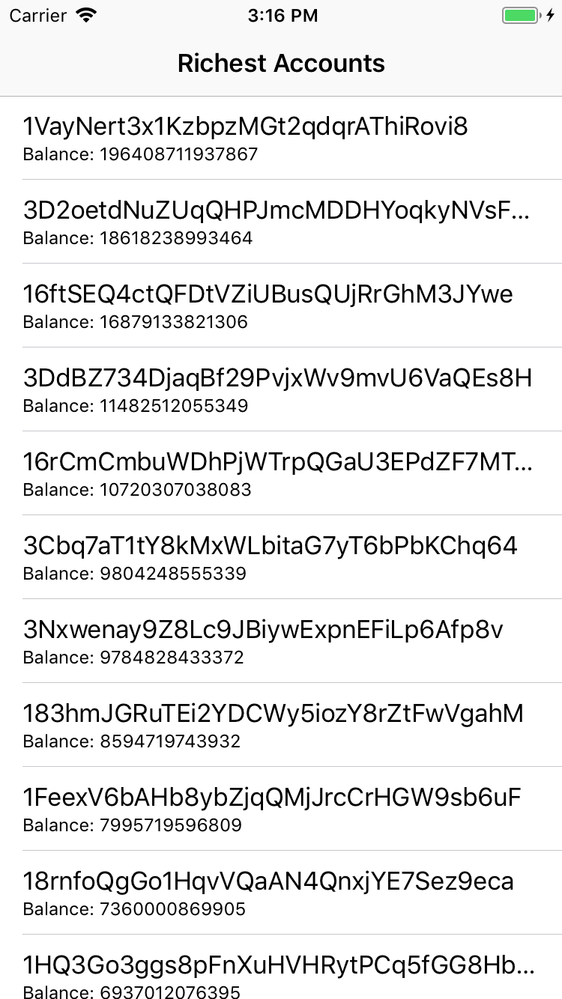

# Quick Start Guide

While the ArcBlock Platform allows you to dive deep into the data on the blockchains, the iOS SDK is for you leverage this capability from iOS without hassles. In this guide, we will walk through the easiest path to create an iOS app based that connects to the ArcBlock OCAP Service.

Let's say you want to make an iOS app that display a list of richest Bitcoin accounts, here's the quickest way to achieve that.

## Install the SDK

You can refer to the [README](./README.md) for installation guide.

## Write your query

To communicate with ArcBlock platform, you will need to use ArcBlock's Open Chain Access Protocol(OCAP) interface. It's a GraphQL interface that provides an unified endpoint for all data operation, and you as developer can customize your own requests(aka queries) under ArcBlock schema. You can go to [ArcBlock OCAP Playground](https://ocap.arcblock.io/) to write and test your ArcBlock OCAP queries. The playground is really easy to use, and is a great place to get started with OCAP API. For more information about GraphQL, please see its [website](https://graphql.org/).

After writing your first query, you can save it as a playbook, and use it to generate Swift codes. Here's the example [playbook](https://ocap.arcblock.io/playbooks/ba3ebcd9-997d-45e6-bd64-b3bed758a13f) for querying the richest Bitcoin accounts.

## Generate Swift codes

One of the great things about GraphQL is that after the queries and schema is finalized, the data are strongly typed. So is Swift! That is to say, we can enforce the queries arguments and the return data type during compile time. This is why we provide this codegen tool to help you generate Swift codes that wraps your queries and works with this iOS SDK. No more type error in runtime!

The swift codegen is directly integrated into the OCAP Playbook. Inside the playbook, you can see a **Generate Codes** button. Choose Swift as Language and generate, and an API.swift file will be downloaded to your local machine. Finally, you just need to drag the file to your project folder.



## Initiate an ABSDKClient

Now let's write some codes!

An ABSDKClient is a GraphQL client that's responsible for sending queries, resolving results, managing caches, etc.. You can create one client for each request, or share one across your app:

``` Swift
// in AppDelegate.swift

var arcblockClient: ABSDKClient!

func application(_ application: UIApplication, didFinishLaunchingWithOptions launchOptions: [UIApplicationLaunchOptionsKey: Any]?) -> Bool {
    // Override point for customization after application launch.
    let databaseURL = URL(fileURLWithPath: NSTemporaryDirectory()).appendingPathComponent("ocap-demo-db")
    do {
        // initialize the AppSync client configuration configuration
        let arcblockConfiguration = try ABSDKClientConfiguration(endpoint: .btc, databaseURL: databaseURL)
        // initialize app sync client
        arcblockClient = try ABSDKClient(configuration: arcblockConfiguration)
    } catch {
        print("Error initializing ABSDKClient. \(error)")
    }
    return true
}
```

## Create your ViewController

Now let's use the ABSDKClient to send our query and display the result. We will create a new ViewController, and you can use our file template to do it.




Now An ABSDKTableViewController and an ABSDKTableViewCell subclass are created.

### Configure your ViewController

Next, we need to configure some properties for the ViewController.

```swift
// in ViewController.swift

override func configDataSource() {
    // config the parameters for initiating data source

    let appDelegate = UIApplication.shared.delegate as! AppDelegate
    client = appDelegate.arcblockClient

    dataSourceMapper = { (data) in
        return data.richestAccounts?.data
    }
    pageMapper = { (data) in
        return (data.richestAccounts?.page)!
    }
    query = RichestAccountsQuery()
}
```

The above codes specify the client to use, the closure to extract the data field, the closure to extract the page field, and the query to send.

## Display data in the cell

Next we need to wire the data field to the UI elements in the TableViewCell

```swift
// in AccountListCell.swift

override func updateView(data: RichestAccountsQuery.Data.RichestAccount.Datum) {
    self.textLabel?.text = data.address
    self.detailTextLabel?.text = "Balance: " + String(data.balance!)
}
```

A XIB file is also created for the cell class, so you can customize the look and feel of the cell as you wish.

## Build and Run

That's it! You can now build and run the app.



The SDK handles sending network requests, resolving result, storing caches, data binding and pagination.

The example project can be find [here](./Example/RichestAccounts).